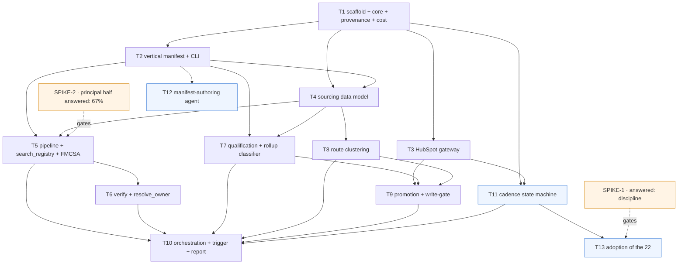

# Ticket Breakdown — Local Prospect Engine (MVP)

**Date:** 2026-09-26 · **Revised:** 2026-09-26 · **Sliced from:** [`../local-prospect-engine.prd.md`](../local-prospect-engine.prd.md) (intent) +
[`../local-prospect-engine.architecture.md`](../local-prospect-engine.architecture.md) (the how)
**Status:** Ready for the PIV loop, behind the gates in *Gates & open decisions*.

> **Revision note.** Two architecture decisions were reversed on evidence and two slices were added. The
> weekly run is a **deterministic pipeline**, not an agent loop (T5 rescoped). The **cadence state machine is
> ours**, because Spike 3 came back saying the portal is Sales Hub Starter with no sequences (new T11; T9
> narrowed; T-ALT1 → T13 *Adoption*). A **manifest-authoring agent** joined the MVP (new T12). Details in the
> architecture doc, marked inline.

## Decisions this breakdown rests on

Previously assumptions; now settled. Change any of them and re-slice the affected tickets.

| # | Decision | Affects |
|---|---|---|
| D1 | **The weekly run is a deterministic pipeline.** The Agent SDK is called at two judgment nodes — `resolve_owner`, `classify_rollup` — and nowhere else in the run. | T5, T6, T7 |
| D2 | **Vertical #1 is Freight & 3PL.** | T2's seed row, T5's first source adapter |
| D3 | **Manifest authoring is agentic and in the MVP.** Agent proposes a DRAFT row; a human activates it on the CLI, recording terms of use as they do. | T2, **T12** |
| D4 | **We own the cadence schedule; HubSpot owns outcomes.** Spike 3: no sequences on Starter. | **T11**, T9, **T13** |
| D5 | **Done = Task complete OR matching activity logged after task creation**, ties breaking toward done. | T11 |
| D6 | **Spike 1 runs alongside Waves 1–2 and ends in adoption** of the surviving 22. **Closed 2026-10-09: discipline**, no further reorder. | Wave order, **T13** |
| D7 | **No budget ceiling; a 500-call Places circuit breaker.** Per-run cost logged from T1. | T1, T6 |
| D8 | **Free before paid; cheaper paid before dearer paid** *(revised 2026-10-09)*. Nothing paid touches a candidate a free filter would drop. Places verification (~$0.03) runs before the `classify_rollup` judgment call (~$0.08) and feeds it evidence. Was: "qualification before verification". | T5, T6, T7 |
| D9 | **Hosted Supabase (dev + prod), local Mac first then a small VPS.** Compose carries no Postgres. | T1 |
| D10 | **GATE-A stays open deliberately** — the `$999 assessment` pipeline is not created; M3 renders *not configured*. | T10 |
| D11 | **Tickets live here**, in-repo markdown. | Nothing structural |
| D13 | **Google Places is a check, never a source** *(2026-10-09)*. The Maps Platform Terms forbid storing Places content. Rules: (1) look up within the run, never ahead; (2) use and discard, keeping only the place ID and our own verdict; (3) Places never discovers prospects. Stored address and phone come from the census, website from the email domain or web search, coordinates from the US Census Geocoder. | T6, T7, T8, T9 |
| D12 | **The run works a backlog in weekly batches** *(2026-10-09)*. Free filters run over the whole pool once (4,449 for freight v3) and persist it. Each run takes a fixed batch (start 150), best first, through the paid steps. **One** judgment call per candidate covers every judgment rule. Census `company_officer_1` comes before `resolve_owner`. | T5, T6, T7, T10 |

---

## Epic summary

Take a brief (vertical · ICP band · geography) and produce a qualified, route-clustered prospect list in
HubSpot with the three-touch cadence scheduled — so ~4 founder-hrs/week go into conversations instead of
Google Maps and a spreadsheet. One FastAPI service, a deterministic pipeline of five manifest-parameterized
stages with the Agent SDK at two judgment nodes, Supabase for machine state, HubSpot for anything a human
reads. The system's job ends the moment a qualified prospect and its scheduled first touch exist in HubSpot:
it does not call, does not knock, and does not send.

**Invariant that cuts across every ticket:** every prospect field carries source URL, retrieval timestamp and
retrieval method, and **a field without provenance cannot be written to HubSpot** (E18 → M6/M8). Built once
in T1, enforced at the boundary in T3 and T9. **The gate governs prospect field writes, not task creation** —
otherwise T13 could never adopt a hand-typed record.

**Measured funnel (freight v3, 2026-10-09):** TX 377,926 → active 194,663 → DFW counties 45,855 → broker code
4,518 → ≤10 power units **4,449 in the backlog** (all free). **Per weekly run (D12):** a batch of 150 → free
QCMobile + revocation checks → Places verify → one judgment call → owner (census first) → ~20 qualified, two
route clusters. ~$25–30 a run, set by the batch size. The original "~600 in, ~80 verified" estimate was ~7×
low on the pool and is superseded.

**Done, per ticket:** `uv run ruff check .` · `uv run mypy . && uv run pyright` · `uv run pytest` all green,
zero suppressions.

---

## Tickets

### T1 — Project scaffold, core infrastructure, provenance primitive

**Scope / acceptance criteria** — one testable concern: *the service boots, validates clean, and the
provenance type exists.*
- `uv` project: `pyproject.toml`, Python 3.12, ruff · MyPy strict · Pyright strict · pytest wired; `/piv-validate` runs green end to end with **zero suppressions**.
- `app/main.py`: FastAPI + lifespan, routers mounted, `GET /health`.
- `app/core/`: `config` (pydantic-settings, `.env`, **strict 12-factor — no local paths, so local→VPS is env vars only**) · `logging` (structlog, `domain.component.action_state`, correlation id) · `database` (async SQLAlchemy over **hosted Supabase**) · `exceptions` · `dependencies`.
- `app/core/cost.py`: **per-run cost and paid-call accounting** — every billable call recorded against a run, with a configurable per-run cap. Lives here, not in T6, so the first run that spends anything measures itself (D7).
- `app/shared/provenance.py`: `ProvenancedValue[T]` — value + `source_url` + `retrieved_at` + `retrieval_method`; constructing one without all three raises `ValidationError`. Plus the `is_promotable()` gate predicate, whose docstring states that it governs **prospect field writes, not task creation**. **Three known consumers (sourcing, qualification, promotion), so it is shared from day one** — not a speculative abstraction.
- Docker Compose (**app only — no Postgres service**, Supabase is hosted) + Alembic baseline migration. Two Supabase projects, dev and prod, wired by env.
- **Explicitly absent:** Redis (decided out), Langfuse, the Vite/React frontend, auth, Supabase RLS.

**Per-ticket context:** architecture → *Stack & libraries* (incl. the "deliberately not carried over" list),
*Runtime*, and *Evidence grounding, generalized to field level* · `.claude/references/vertical-slice-architecture.md` →
Rule 1 (`core/`) and Rule 2 (the three-feature rule) · CLAUDE.md → *Ground rules*.
**Files:** `pyproject.toml`, `docker-compose.yml`, `alembic/`, `app/main.py`, `app/core/*.py`, `app/shared/provenance.py`, `tests/`
**Size:** ~800–1100 lines (~40% tests) · **Depends on:** none · **Blocks:** everything

---

### T2 — Vertical manifest slice (the M9 lever)

**Scope / acceptance criteria** — *vertical is data, and a second vertical is a row.*
- Pydantic v2 manifest schema: `sources[]` (name · kind · base_url · **terms-of-use decision** · rate limits) · `disqualifier_rules[]` · `qualifying_signals[]` · `icp_band` (headcount min/max + office-function flag) · `vocabulary` · `version` · `status` · `active`.
- **Lifecycle `DRAFT → ACTIVE`** (D3). The authoring agent (T12) writes drafts; a human activates. Versioned: a bump writes a new row, the old row is retained.
- `vertical_manifest` table + migration, repository (`get_active(vertical)`, `get(vertical, version)`, `create_draft`, `activate`), service, read-only routes.
- **CLI** — `lpe manifest show <id>` renders a draft with every citation; `lpe manifest activate <id> --accept-terms <sources>` records the per-source terms-of-use decision and flips the row active. This is the review surface; there is no frontend and no second login.
- A source with no recorded terms-of-use decision **cannot be marked active** (test). A DRAFT row is never returned by `get_active` (test).
- **Seeded: freight** — FMCSA/SAFER; asset-based-carrier exclusion + double-brokering flag; "which TMS, and does it have an API"; 20–200 with an office function; loads/lanes/carrier-packets/COIs/check-calls/detention vocabulary.
- **Seeded: fire** — Texas State Fire Marshal registry + Google Places (as a check only, D13); national-rollup-with-no-local-owner exclusion; owner-accessible signal; inspection/permit/AHJ vocabulary. *Seeding both is how M9 gets proven before it is claimed.*
- Test asserts no `if vertical ==` branch anywhere in `app/`.

**Per-ticket context:** `.claude/references/adding-a-vertical.md` (whole file) · architecture → *Vertical as a
declarative manifest, not code* and *Missing pieces* · PRD §6 portability table · M9.
**Files:** `app/manifests/{schemas,models,repository,service,routes,cli,exceptions,README}.py`, `alembic/versions/`, `tests/manifests/`
**Size:** ~1000–1300 lines · **Depends on:** T1 · **Blocks:** T4, T5, T7, T12

---

### T3 — HubSpot gateway: client, custom properties, dedupe

**Scope / acceptance criteria** — *we can talk to HubSpot safely, and cannot create a duplicate.*
- httpx client, private app token from env, scoped contacts/companies/deals/tasks read+write; 429/backoff; every call logged `promotion.hubspot.*`.
- **Idempotent custom-property provisioning:** source URL · sourced-at · vertical · priority score · route cluster. None exist in the portal today. Second run no-ops.
- **Dedupe on domain *and* phone before any create** — the portal holds 3,118 contacts and 1,040 companies of mixed provenance. Existing match → returns the match, creates nothing.
- The `is_promotable()` gate is enforced **at the client boundary** for prospect field writes, so no later slice can route around it — and task creation is explicitly *not* gated (T13 depends on this).
- **Tier-aware:** Starter, so no sequences endpoint. Tasks, activities and CRM objects only.
- Tests run against recorded fixtures — no live portal calls in CI.

**Per-ticket context:** `.claude/references/hubspot-integration.md` (whole file) · architecture →
*Boundaries & contracts* · E14/E18 · M4/M8.
**Files:** `app/promotion/{client,properties,dedupe,exceptions}.py`, `tests/promotion/`, fixtures
**Size:** ~900–1200 lines · **Depends on:** T1 · **Parallel with:** T2 · **Blocks:** T9, T11

---

### T4 — Sourcing data model: `sourcing_run` + `candidate` with field-level provenance

**Scope / acceptance criteria** — *a run and its candidates persist, and every field remembers where it came from.*
- `sourcing_run` (brief: vertical · ICP band · geography; timings; counts; **cost**; status) and `candidate` (business identity, **each field carrying its own provenance**) + migrations.
- Repository with idempotent upsert keyed on (run, registry id); run lifecycle service.
- Round-trip test: provenance survives persist→load. A candidate with an unprovenanced field is **storable but not promotable** — the workbench may hold it; HubSpot may not receive it.

**Per-ticket context:** architecture → *Data model — the shape* · `shared/provenance.py` from T1 ·
`.claude/references/vertical-slice-architecture.md` Rule 3.
**Files:** `app/sourcing/{models,schemas,repository,service,exceptions}.py`, `alembic/versions/`, `tests/sourcing/`
**Size:** ~700–1000 lines · **Depends on:** T1, T2 · **Blocks:** T5, T7, T8

---

### T5 — Sourcing pipeline + `search_registry` stage + FMCSA adapter

**Scope / acceptance criteria** — *a brief produces cited candidates from the manifest's declared source.*
- **Deterministic pipeline runner** in `app/sourcing/service.py` — ordinary async Python, stages executed in a declared order, each stage's output persisted with provenance. **No agent loop** (D1).
- ~~**`app/tools/` registry established here**~~ — *landed ahead of T5 as the seam PR (2026-10-10)*. T5 adds `app/tools/search_registry.py` and builds the runner over `registered_stages()`.
- Stage 1 of 5: `search_registry(manifest_source, query)` — generic, manifest-parameterized, never source-specific.
- **FMCSA adapter, census-file-first.** QCMobile is a *lookup* API keyed on USDOT/MC, not a search-by-geography API — so: pull the bulk Company Census File, filter to DFW counties + active broker authority, then QCMobile per record for MC number, authority status, fleet size, BOC-3 filings. (E10: this is the exact judgment whose absence produced a 74-row file of BOC-3 process agents instead of brokers.)
- Brief → `sourcing_run` → candidates persisted with provenance on every field.
- **The backlog and the batch (D12, 2026-10-09).** The census filter runs over the whole pool once (4,449 for freight v3) and persists it. Each run then selects a **fixed batch** (setting, default 150) **best first**, with a deterministic order: current MCS-150 filing (within 2 years) first, then a named `company_officer_1`, then the stable tie-breaker. Selected candidates are marked so a candidate is never batched twice, and the pool works down run over run. **Test:** two runs over one fixture pool select disjoint batches in the same order every time.
- **Free checks before anything paid (D8):** QCMobile `allowToOperate` and the revocations join run on the batch in code, not by a model. They need a free FMCSA webKey. **`power_units` and other numeric census fields arrive as text**, so cast them at the adapter.
- **Portability test:** pointing the same stage at the fire manifest hits the fire source with **no code change** (stub source in tests).
- **Determinism test:** same fixture input → identical candidate set and ordering across runs.
- Recorded fixtures; no live network in tests.

**Per-ticket context:** architecture → *Recommended approach* (incl. why a pipeline, not a loop), *Five generic
stages, not one per source*, *Boundaries & contracts* → FMCSA · `.claude/references/adding-a-vertical.md` ·
E10 · **SPIKE-2 result** (below).
**Files:** `app/tools/{__init__,search_registry}.py`, `app/sourcing/{service,pipeline,sources/fmcsa}.py`, `tests/`
**Size:** ~1100–1500 lines · **Depends on:** T2, T4 · **Gated by:** ~~SPIKE-2~~ cleared 2026-10-10 (principal half; headcount does not gate)

---

### T6 — Enrichment stages: `verify_business` + `resolve_owner`

**Scope / acceptance criteria** — *the two fields the ICP filter and M6 depend on get filled, or stay empty — never guessed.*
- Stages 2 and 3: verify business identity (**a Places check of the census record**, D13) and resolve the owner/principal (registry principal, SOS filing; the review-name signal is dropped because reviews cannot be stored). **`resolve_owner` is one of the two Agent SDK judgment nodes** — structured output, with a citation attached to every field it returns.
- **Runs after the free filters, before the judgment call** (D8, revised 2026-10-09). Nothing paid touches a candidate a free filter would drop. `verify_business` is the cheaper paid step (~$0.03), and its website, phone and business type are the evidence T7's single judgment call reads.
- **Owner: census first** (D12). Census `company_officer_1` is a cited principal for 67% of the freight v3 pool, so `resolve_owner`, the judgment node, runs **only where it is absent**. That halves the hardest problem in the system before any model is called.
- **Places is a check, never a source (D13).** Rules: look up only the current batch while it is processed; use the response and discard it; never use Places to find candidates. Store only the **place ID** and our verdict. Stored fields come from licensed sources: **address and phone from the census** (`bulk_file` provenance), **website from the census email domain or a web search**. Request only Pro-tier fields (`id`, `displayName`, `formattedAddress`, `businessStatus`, `types`): $32 per 1,000 after 5,000 free a month, so ~$0 at a batch of 150. Never request phone, website or reviews.
- Test: no Places field other than the place ID is ever written to `candidate`. A structure guard should reject one.
- ~~**Decide when planning:** store the verdict, or only the place ID~~ — **decided 2026-10-09: the place ID only** (`CandidateFields.business_check`, owned by `verify_business`). The data model and the D13 guard (no other field may cite Google Maps) are already built. **Two things left to T6:** (1) tie a check to the address it checked, so a later registry re-run that *changes* the address un-verifies it (compare values, not `retrieved_at`, which every re-run refreshes; PR #13 review L2); (2) whether to record "checked, not found" so a miss is not paid for twice.
- **Per-run call budget enforced via `core/cost.py` and logged**, default cap 500 Places calls. Exceeding it marks the run *degraded* and stops enrichment — it does not crash and does not silently continue spending.
- Every written field carries provenance; a field that cannot be cited is **left absent**, not inferred. This is the structural fix for E18 (a company name sitting in a first-name field is exactly a field nobody could cite).
- Measured over the fixture sample: **≥70% named decision-maker (M6)**, **100% headcount-band fill or absent (M8)**. If SPIKE-2 confirms FMCSA cannot yield headcount for non-asset brokers, the ICP band leans on web signals and *absent* is the honest common case. Places cannot supply a stored headcount (D13).

**Per-ticket context:** architecture → *Missing pieces* ("owner resolution — the hardest single problem in the
system"), *Boundaries & contracts* (Google Places), *Cost: a circuit breaker, not a ceiling* · E18 · M6/M8.
**Files:** `app/tools/{verify_business,resolve_owner}.py`, `app/sourcing/sources/google_places.py`, `tests/`
**Size:** ~1000–1400 lines · **Depends on:** T5 (no longer T7: verification now runs before the judgment call, D8)

---

### T7 — Qualification slice: disqualifiers, rollup classifier, priority score

**Scope / acceptance criteria** — *the rules in a founder's head become rows, and a rejected rollup stays rejected.*
- Disqualifier rule engine driven entirely by the manifest (no rule literals in the slice). Free, and runs before anything billable. **What the evaluator has to handle, from the freight v3 review:**
  - **All the operators,** including `not_contains` and `not_in_set` (PRs #10, #11).
  - **Casts:** census numerics such as `power_units` arrive as text.
  - **A field's source:** `allowToOperate` lives in QCMobile, not the census, so a predicate needs to know which source its field comes from.
  - **Joins:** `authority_revoked` is a join against the revocations dataset, so give it a mechanical path rather than a model call.
- Stage 4 of 5: `classify_rollup_vs_local`, **the second Agent SDK judgment node**, with a citation attached to the verdict. **One call per candidate decides every judgment rule in the manifest** (D12), e.g. rollup, `self_employed_shell` and `authority_revoked`'s reason, never one call per rule. It reads T6's Places response as evidence, in the same run, and discards it afterwards (D13). Only the verdict and its citation are stored. ~$0.08 a candidate, measured.
- `disqualification` table: candidate + the rule that fired + when. **Re-source suppression:** a disqualified candidate is not re-sourced next run — tested across two runs. This is the thing a HubSpot-only model cannot do.
- Priority score: Intensity (1–5) × Automatable (1–5) = 1–25; ≥16 live, <9 dead (E9), computed from cited signals.
- Fixture test: the four known rollups (Impact Fire, Summit Fire, Century Fire, Control Systems) classify as rollup; **<5% rollup false positives** (M6).
- **Manifest dry-run: the quality check (decided 2026-10-09).** `lpe manifest dry-run <id>` runs a manifest's **free** rules through this evaluator against the real source data and prints the pool size after each rule, plus a few sample rows that pass and a few that fail. It writes nothing and makes no paid calls. It works on a DRAFT, and `activate` refuses a manifest that has no recorded dry-run. This automates the hand check that caught freight v1 (a rule matching nothing) and v2 (an exclusion list that let through anything it didn't list). Tests: a rule that matches nothing and a rule that excludes nothing are both flagged in the output.
- **If cheap once the evaluator exists:** check at proposal time that each rule's field, and its literal values, appear in a sample of the source data (v1's `'asset_based'` against the real A/B/C).

**Per-ticket context:** E7 · E9 · architecture → *Missing pieces* ("a rollup-vs-local classifier") · M6 ·
PRD §4 WRONG condition (founder rejects ≥30% → qualification judgment cannot be encoded).
**Files:** `app/qualification/*`, `app/tools/classify_rollup.py`, `alembic/versions/`, `tests/qualification/`
**Size:** ~900–1300 lines · **Depends on:** T2, T4 · **Parallel with:** T5, T6, T8. In the run, the judgment call consumes T6's verified fields; that is a data contract on `candidate` (T4), so it is not a build dependency.

---

### T8 — Routing slice: DFW route clustering

**Scope / acceptance criteria** — *20 names come out as two drive routes, the way the target list already does by hand.*
- Stage 5 of 5: `cluster_routes` — deterministic geographic clustering, no LLM.
- Cluster labels and size caps matching the cadence: ~10–12 doors per outing, 20 names / 2 clusters per week (E3, E4; the hand-built Route Cluster A: Olympic Drive, Cluster B: 75238).
- Stable assignment: same input → same clusters across runs.
- A candidate **without a verified address is excluded from clustering**, not geocoded from a guess. The rule is `CandidateFields.has_verified_address()`: the census address **and** a `business_check` (built 2026-10-09).
- **Coordinates come from the US Census Geocoder** (free, public domain) on the census address, never from Places. Places lat/lng may be cached for only 30 days and is barred as input to point-in-polygon analysis (D13).

**Per-ticket context:** E4 · E5 · architecture → *Missing pieces* ("DFW geographic route clustering — done by
hand today") · PRD §6 step 5.
**Files:** `app/routing/*`, `app/tools/cluster_routes.py`, `tests/routing/`
**Size:** ~500–800 lines · **Depends on:** T4 · **Parallel with:** T5, T7

---

### T9 — Promotion slice: the write-gate, HubSpot create, promotion ledger

**Scope / acceptance criteria** — *a candidate graduates only when it qualifies **and** a human accepts it.*
- The write-gate, enforced and typed: any required field lacking provenance → refused with a typed exception and a logged event. **No partial writes.** The gate covers prospect field writes only — task creation is T11's and is not gated.
- Create Company + Contact at a **`pending review`** stage with the custom properties from T3 — review happens in HubSpot; there is no frontend and no second login.
- `promotion` ledger: candidate → the HubSpot company/contact ids it became. Idempotent: re-running promotes nothing twice.
- **Hands off to T11** for the cadence: promotion's job ends when the record exists and the first touch has been requested.
- **Adopted contacts (T13) already exist in HubSpot and carry no provenance.** The first field write to one of them cites `retrieval_method = "manual_hubspot_entry"`, source = the HubSpot record URL, `retrieved_at` = the record's create date — honest, not an exemption *(moved here from T13, 2026-10-10)*.

**Per-ticket context:** `.claude/references/hubspot-integration.md` · architecture → *Review surface: HubSpot,
no frontend* · M4/M8.
**Files:** `app/promotion/{service,gate,models,repository,routes}.py`, `alembic/versions/`, `tests/promotion/`
**Size:** ~900–1200 lines · **Depends on:** T3, T7, T8

---

### T11 — Cadence slice: the three-touch state machine *(new — D4)*

**Scope / acceptance criteria** — *nobody is contacted once and silently dropped, and the schedule lives in exactly one place.*
- `cadence_state` table + migration: **schedule only** — which touch is due, which cycle we're in, parked or live. **No outcomes.**
- The state machine: call → voicemail → same-day email **draft** → wait four days → repeat twice → **park after three cycles**.
- Touches are written to HubSpot as **Tasks** (Starter has no sequences — Spike 3). Call and door touches are founder tasks; the **email touch is drafted, never sent** — nothing sends from any domain until Spike 4.
- **Outcome sync:** a touch is done when its Task is complete **or** a matching activity was logged on the contact *after that task's creation timestamp*; ties break toward done (D5). Outcomes are read from HubSpot, never stored on our side.
- Surfaces overdue touches. Idempotent: a second sync in the same day schedules nothing twice.
- Tests: the full three-cycle walk including park; the "already done by hand" case advances rather than re-fires; recorded fixtures only.

**Per-ticket context:** `.claude/references/hubspot-integration.md` (whole file) ·
`.claude/references/outreach-messaging.md` (never lead with AI, E16) · architecture → *Cadence: we own the
schedule, HubSpot owns the outcomes* · E15 · M5 · **SPIKE-4** (nothing sends).
**Files:** `app/cadence/{models,schemas,repository,service,sync,routes,exceptions,README}.py`, `alembic/versions/`, `tests/cadence/`
**Size:** ~1100–1500 lines · **Depends on:** T1, T3 · **Parallel with:** the entire sourcing line

---

### T12 — Manifest-authoring agent *(new — D3)*

**Scope / acceptance criteria** — *adding a vertical is reviewing a proposal, not writing a row.*
- `lpe manifest propose "<brief>"` — an Agent SDK loop that researches a vertical: the authoritative registry, the disqualifier rules, the qualifying signals, the ICP band, the vocabulary.
- Writes a **DRAFT** `vertical_manifest` row. **Every proposed field carries a citation**; a field it cannot cite is left absent, exactly as in the sourcing pipeline.
- Proposes the per-source terms-of-use question but **never answers it** — `activate` is the human's, and a source without that decision cannot go active (enforced in T2).
- This is the one genuinely open-ended job in the system, and the only place an agent drives control flow at run time.
- Test: the agent's freight proposal, run against recorded fixtures, names FMCSA and produces an asset-based-carrier exclusion.

**Per-ticket context:** `.claude/references/adding-a-vertical.md` · architecture → *Recommended approach* →
"Where the agent does earn its keep" · M9 · **the open question on manifest *quality* review** (below).
**Files:** `app/manifests/{agent,prompts}.py`, `tests/manifests/`
**Size:** ~800–1100 lines · **Depends on:** T2

---

### T13 — Adoption: bring the existing 22 into the machine *(was T-ALT1 — D6)*

**Scope / acceptance criteria** — *the prospects already in HubSpot stop being a queue nobody works.*
- Read the surviving open prospects of the 22 (11 were already past due at slice time) and enrol them in the cadence state machine. **No new sourcing.**
- **Adoption writes no prospect field and creates no `candidate`.** Honest `manual_hubspot_entry` provenance applies at the first field write, which is T9 *(decided 2026-10-10; this replaces "adopted candidates carry honest provenance")*.
- **An explicit roster** *(decided 2026-10-10)*: `lpe cadence adopt --dry-run` lists every contact on an open hand task with its evidence; a person writes a TOML roster marking each `adopt` or `park` (optional `start` override, optional `company`); `adopt --roster <file>` applies it under the sync lock. Re-running is a no-op.
- **Evidence from the contact only**, exactly what the daily sync reads. A touch logged only on the company is missed; the roster's `start` covers it.
- **Old hand tasks are left and listed**, never written: their ids are printed for a person to close.
- **Cycle position is reconstructed from logged activity, never reset** — a prospect touched twice by hand resumes at touch three, and park-after-three-cycles counts those prior touches.
- Runs **after Spike 1 closes**, so the spike ends with a lever attached rather than as an observation. *(Closed 2026-10-09: discipline. 1 of 22 tasks completed.)*
- **Surviving** excludes explicit refusals: the "do not call them again" prospect and the two "not interested" replies of 09-28 are parked or exited, never enrolled. Most past touches are **notes** on unticked tasks, so reconstruction must count them.
- Test: a record with zero citable fields adopts successfully (proving the gate covers field writes, not task creation); a record with two prior logged calls resumes at touch three.

**Per-ticket context:** E15 (0 of 22 completed, 11 past due) · PRD JTBD (secondary) · M5 · architecture →
*Spike 1* and *Cadence*.
**Files:** `app/cadence/{adoption,schemas,service,repository,cli,exceptions}.py`, `app/promotion/schemas.py` (`SearchOperator.neq`), `tests/cadence/`
**Size:** ~500–800 lines · **Depends on:** T11 · **Gated by:** ~~SPIKE-1 closing~~ cleared 2026-10-09

---

### T10 — Weekly run orchestration, trigger endpoint, Friday report

**Scope / acceptance criteria** — *one brief in, a worked list in HubSpot in under an hour, unattended.*
- `POST /runs` (the weekly-run trigger) wiring source → qualify → verify/enrich → cluster → promote → schedule. One weekly scheduled trigger plus ad-hoc, driven externally (launchd, later cron). **No Celery, no queue** — one user, one run a week.
- M7 instrumentation: brief → HubSpot timing recorded per run, target **< 1 hour unattended**. Per-run cost reported alongside it (D7).
- Friday report: the four numbers unchanged from the playbook — doors knocked · owner conversations · assessments booked · paid assessments sold — read from HubSpot, not from a spreadsheet.
- **M3 renders `not configured`, never `0`** — the `$999 assessment` pipeline does not exist and we have decided not to create it (D10, GATE-A). An uninstrumented zero and a real zero are different facts.
- Failure semantics: a degraded enrichment run still promotes what it can cite, and says what it dropped.
- **Before the first real run (Spike 1 checkpoint, 2026-10-09):** read M5 on the T13-adopted prospects. If touches still are not getting done with the machine running, fix that before the run adds volume. This is a human check, not a code gate.

**Per-ticket context:** PRD §6 steps 1–8 · M7 · architecture → *Scheduling: boring on purpose*, *Cost* ·
**GATE-A**.
**Files:** `app/main.py`, `app/sourcing/routes.py`, `app/reporting/*`, `tests/`
**Size:** ~800–1200 lines · **Depends on:** T5, T6, T7, T8, T9, T11

---

## Dependency graph

## Suggested execution order

| Wave | Tickets | Parallel? | Note |
|---|---|---|---|
| **0** | SPIKE-2 (1 day, offline against the census file) — SPIKE-1 runs across Waves 1–2 | — | SPIKE-3 is answered; SPIKE-4 is out of MVP scope |
| **1** | **T1** | no | Blocks everything |
| **2** | **T2** ∥ **T3** | 2 worktrees | Disjoint (`manifests/` vs `promotion/`) |
| **3** | **T4** ∥ **T11** ∥ **T12** | 3 worktrees | `sourcing/` · `cadence/` · `manifests/`. T11 needs no sourcing at all, so the cadence machine exists before the first list does |
| **4** | ~~**T7** ∥ **T8** ∥~~ **T13** | — | Spike 1 closed 2026-10-09 (discipline): T13 is unblocked and stays in parallel, and the 22 enter the machine here. **T7 and T8 moved to Wave 5** (2026-10-10) |
| **5** | **T5** ∥ **T7** ∥ **T8** | 3 worktrees | *Revised 2026-10-10.* `sourcing/`+`tools/search_registry` · `qualification/`+`tools/classify_rollup` · `routing/`+`tools/cluster_routes`. Cut from the `app/tools/` stage-contract seam PR. Migrations pre-numbered: T5 `0006`, T8 `0007`, T7 `0008`, re-chained at merge; merge order T5 → T8 → T7 |
| **5b** | **T9** | no | Depends on T7 and T8, so it cannot run beside them; plan it once both are merged |
| **6** | **T6** | no | After T5. No longer waits for T7: verification now runs before the judgment call (D8, revised 2026-10-09) |
| **7** | **T10** | no | Integration; plan it last, when the seams are real |

**Note the ordering** *(revised 2026-10-09)*. Within a run it goes free filters, then Places (T6), then one judgment
call (T7), then owner (census first, then T6's `resolve_owner`): **free before paid, cheaper paid before
dearer paid** (D8). T7's free rule engine still runs before anything billable; only the paid steps swapped,
because Places is cheaper than a judgment call and is the evidence that call reads. T11 moved early: it depends only on T1 and
T3, so the cadence machine can be working the existing 22 while the sourcing line is still being built.

**The `app/tools/` parallelization seam.** Four tickets add one of the five stages each (T5→1, T6→2 and 3,
T7→4, T8→5). *Revised 2026-10-10:* the registry landed **before** T5, as its own seam PR
(`app/tools/registry.py`), so the three Wave 5 branches start from the same contract. A stage registers by
**being a file**: `app/tools/<stage>.py`, named for its `PipelineStage` value and exporting `STAGE`. There is no
shared list to append to, because three branches appending at the same line conflict, which is what the seam
exists to prevent.

**Plan just-in-time.** Independent tickets in a wave can be planned and run in parallel. A dependent ticket
waits until its dependency is *implemented*, not merely sliced — planning T9 before T7 exists is planning
against a guess.

---

## Gates & open decisions

**Spikes:**

| Gate | Question | Timebox | Blocks |
|---|---|---|---|
| SPIKE-1 | Is the constraint sourcing, or discipline? | 2 weeks | **ANSWERED 2026-10-09: discipline.** 1 of 22 tasks done, 0 decision-maker conversations, nothing logged after day 4. No further reorder. T13 is unblocked and runs in parallel. **Checkpoint:** read M5 on the adopted prospects before T10's first real run |
| SPIKE-2 | Does FMCSA yield a named principal **and** a headcount band for DFW non-asset brokerages? | 1 day | **T5.** Run offline against the bulk census file. <50% principal yield → the freight manifest needs a second source from day one and M6's 70% needs re-basing. **The headcount half is expected to fail** — FMCSA's power-unit/driver fields describe carriers, not brokers. **Principal half measured 2026-10-09:** census `company_officer_1` is present for **67%** of freight v3's 4,449 DFW pool, which clears the 50% bar. Whether those officers are the decision-maker M6 means is still unchecked, and the headcount half is not yet run. **No longer gates T5 (decided 2026-10-10):** the principal half is enough to build on; headcount affects only ICP-band fill (M8), where *absent* is the honest answer |
| SPIKE-3 | Does our HubSpot tier have sequences, or only tasks? | — | **ANSWERED.** Starter — no sequences, workflows capped. Forced D4 |
| SPIKE-4 | Can we send without risking `compumatrice.com`? | — | **Out of MVP scope.** No ticket here sends. T11 drafts the email touch only |

**Still open:**

- **Who reviews manifest *quality*, beyond terms of use?** T12's agent can propose a plausible-but-wrong
  disqualifier or a mis-chosen authoritative source, and that failure is silent — it yields a credible list
  of the wrong companies, which is E10 exactly. `activate` catches the legal question, not the correctness
  one. **Decided 2026-10-09: the dry-run in T7.** `activate` requires a recorded dry-run (step-by-step pool
  counts plus sample rows), and a human reads it. A critic agent was rejected: it shares the author's blind
  spots and cannot see the real data. A checklist alone was rejected: it relies on the discipline Spike 1 found
  lacking.
- ~~**Google Places terms of use**~~ — **read 2026-10-09 → D13**: a check, never a source. When activating, accept
  Places's terms on that basis.
- ~~**Google Places real pricing**~~ — **confirmed 2026-10-09**: Pro tier, $32 per 1,000 after 5,000 free a month,
  so ~$0 at a batch of 150. Phone and website (Enterprise) are no longer requested.
- **Langfuse — keep or drop?** Leaning drop: with the run deterministic, structlog plus per-run cost logging
  covers most of what tracing would have given us.
- **GATE-A: the `$999 assessment` deal pipeline does not exist** and is deliberately not being created. M3 is
  unreportable; T10 says so explicitly rather than reporting `0`.
- **Who rewrites the opener, and by when** (E16) — blocks the email leg, not any ticket here, because
  nothing sends.

**Credentials:** HubSpot private app token ✅ · Anthropic API key ✅ · FMCSA webkey ❌ (free, ~2 min; not
needed if SPIKE-2 runs against the census file) · Google Places ❌ (needs a GCP project with billing; not
needed until T6, which builds against fixtures).

**Deliberately absent, and staying absent:** Redis · Langfuse · Celery/queues · the template's Vite/React
frontend · auth · Supabase RLS · multi-metro · any autonomous calling, knocking or sending.
