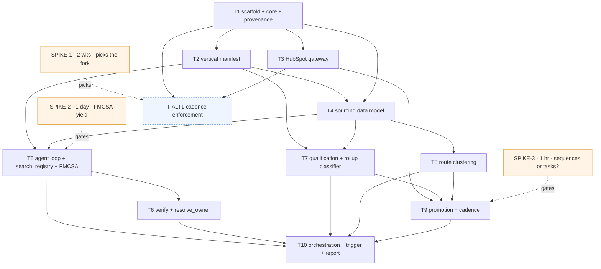

# Ticket Breakdown — Local Prospect Engine (MVP)

**Date:** 2026-09-26 · **Sliced from:** [`../local-prospect-engine.prd.md`](../local-prospect-engine.prd.md) (intent) +
[`../local-prospect-engine.architecture.md`](../local-prospect-engine.architecture.md) (the how)
**Status:** Ready for the PIV loop, behind the gates in *Gates & open decisions*.

## Assumptions this breakdown was written under

These sit unanswered on the docs' own open-question lists. They were **stated, not silently answered** —
change any of them and re-slice the affected tickets.

| # | Assumption | Where it came from | What changes if it's wrong |
|---|---|---|---|
| A1 | **Spike 1 has not run yet.** It is in flight alongside Wave 1–2. | Architecture → *Spikes*, "blocks the first slice" | Nothing in Waves 1–2 — those are deliberately Spike-1-independent. It picks the **fork** at Wave 3 (see *The Spike 1 fork*). |
| A2 | **Vertical #1 is Freight & 3PL**, per the architecture's recommendation. | PRD §9, "Founder's call" | T2's seed row and T5's first source adapter (FMCSA/SAFER → Texas Fire Marshal). Every other ticket is manifest-parameterized and unaffected — that is the M9 test. |
| A3 | **Tickets live here**, in-repo markdown. | No Atlassian MCP in session; solo workflow | Nothing structural — mirror into a tracker if one appears. |

---

## Epic summary

Take a brief (vertical · ICP band · geography) and produce a qualified, route-clustered prospect list in
HubSpot with the three-touch cadence scheduled — so ~4 founder-hrs/week go into conversations instead of
Google Maps and a spreadsheet. One FastAPI service, a Claude Agent SDK loop over five manifest-parameterized
MCP tools, Supabase for machine state, HubSpot for anything a human reads. The system's job ends the moment a
qualified prospect and its scheduled first touch exist in HubSpot: it does not call, does not knock, and does
not send.

**Invariant that cuts across every ticket:** every prospect field carries source URL, retrieval timestamp and
retrieval method, and **a field without provenance cannot be written to HubSpot** (E18 → M6/M8). It is built
once in T1 and enforced at the boundary in T3 and T9.

**Done, per ticket:** `uv run ruff check .` · `uv run mypy . && uv run pyright` · `uv run pytest` all green,
zero suppressions.

---

## Tickets

### T1 — Project scaffold, core infrastructure, provenance primitive

**Scope / acceptance criteria** — one testable concern: *the service boots, validates clean, and the
provenance type exists.*
- `uv` project: `pyproject.toml`, Python 3.12, ruff · MyPy strict · Pyright strict · pytest wired; `/piv-validate` runs green end to end with **zero suppressions**.
- `app/main.py`: FastAPI + lifespan, routers mounted, `GET /health`.
- `app/core/`: `config` (pydantic-settings, `.env`) · `logging` (structlog, `domain.component.action_state`, correlation id) · `database` (async SQLAlchemy over Supabase/Postgres) · `exceptions` · `dependencies`.
- `app/shared/provenance.py`: `ProvenancedValue[T]` — value + `source_url` + `retrieved_at` + `retrieval_method`; constructing one without all three raises `ValidationError`. Plus the `is_promotable()` gate predicate. **Three known consumers (sourcing, qualification, promotion), so it is shared from day one** — not a speculative abstraction.
- Docker Compose (Postgres) + Alembic baseline migration.
- **Explicitly absent:** Redis, Langfuse, the Vite/React frontend, auth, Supabase RLS.

**Per-ticket context:** architecture → *Stack & libraries* (incl. the "deliberately not carried over" list) and
*Evidence grounding, generalized to field level* · `.claude/references/vertical-slice-architecture.md` →
Rule 1 (`core/`) and Rule 2 (the three-feature rule) · CLAUDE.md → *Ground rules*.
**Files:** `pyproject.toml`, `docker-compose.yml`, `alembic/`, `app/main.py`, `app/core/*.py`, `app/shared/provenance.py`, `tests/`
**Size:** ~700–1000 lines (~40% tests) · **Depends on:** none · **Blocks:** everything

---

### T2 — Vertical manifest slice (the M9 lever)

**Scope / acceptance criteria** — *vertical is data, and a second vertical is a row.*
- Pydantic v2 manifest schema: `sources[]` (name · kind · base_url · **terms-of-use decision** · rate limits) · `disqualifier_rules[]` · `qualifying_signals[]` · `icp_band` (headcount min/max + office-function flag) · `vocabulary` · `version` · `active`.
- `vertical_manifest` table + migration, repository (`get_active(vertical)`, `get(vertical, version)`), service, read-only routes. Versioned: a bump writes a new row, the old row is retained.
- **Seeded: freight** — FMCSA/SAFER; asset-based-carrier exclusion + double-brokering flag; "which TMS, and does it have an API"; 20–200 with an office function; loads/lanes/carrier-packets/COIs/check-calls/detention vocabulary.
- **Seeded: fire** — Texas State Fire Marshal registry + Google Places; national-rollup-with-no-local-owner exclusion; owner-accessible signal; inspection/permit/AHJ vocabulary. *Seeding both is how M9 gets proven before it is claimed.*
- A source with no recorded terms-of-use decision **cannot be marked active** (test).
- Test asserts no `if vertical ==` branch anywhere in `app/`.

**Per-ticket context:** `.claude/references/adding-a-vertical.md` (whole file) · architecture → *Vertical as a
declarative manifest, not code* and *Missing pieces* ("the manifest schema does not exist yet") · PRD §6
portability table · M9.
**Files:** `app/manifests/{schemas,models,repository,service,routes,exceptions,README}.py`, `alembic/versions/`, `tests/manifests/`
**Size:** ~800–1100 lines · **Depends on:** T1 · **Blocks:** T4, T5, T7

---

### T3 — HubSpot gateway: client, custom properties, dedupe

**Scope / acceptance criteria** — *we can talk to HubSpot safely, and cannot create a duplicate.*
- httpx client, private app token from env, scoped contacts/companies/deals/tasks read+write; 429/backoff; every call logged `promotion.hubspot.*`.
- **Idempotent custom-property provisioning:** source URL · sourced-at · vertical · priority score · route cluster. None exist in the portal today. Second run no-ops.
- **Dedupe on domain *and* phone before any create** — the portal holds 3,118 contacts and 1,040 companies of mixed provenance. Existing match → returns the match, creates nothing.
- The `is_promotable()` gate is enforced **at the client boundary**, so no later slice can route around it.
- Tests run against recorded fixtures — no live portal calls in CI.

**Per-ticket context:** `.claude/references/hubspot-integration.md` (whole file) · architecture →
*Boundaries & contracts* · E14/E18 · M4/M8.
**Files:** `app/promotion/{client,properties,dedupe,exceptions}.py`, `tests/promotion/`, fixtures
**Size:** ~900–1200 lines · **Depends on:** T1 · **Parallel with:** T2 · **Serves both Spike 1 branches**

---

### T4 — Sourcing data model: `sourcing_run` + `candidate` with field-level provenance

**Scope / acceptance criteria** — *a run and its candidates persist, and every field remembers where it came from.*
- `sourcing_run` (brief: vertical · ICP band · geography; timings; counts; status) and `candidate` (business identity, **each field carrying its own provenance**) + migrations.
- Repository with idempotent upsert keyed on (run, registry id); run lifecycle service.
- Round-trip test: provenance survives persist→load. A candidate with an unprovenanced field is **storable but not promotable** — the workbench may hold it; HubSpot may not receive it.

**Per-ticket context:** architecture → *Data model — the shape* · `shared/provenance.py` from T1 ·
`.claude/references/vertical-slice-architecture.md` Rule 3.
**Files:** `app/sourcing/{models,schemas,repository,service,exceptions}.py`, `alembic/versions/`, `tests/sourcing/`
**Size:** ~700–1000 lines · **Depends on:** T1, T2 · **Blocks:** T5, T7, T8

---

### T5 — Agent loop + `search_registry` tool + FMCSA/SAFER adapter

**Scope / acceptance criteria** — *a brief produces cited candidates from the manifest's declared source.*
- `ClaudeSDKClient` loop in `app/sourcing/service.py`; **`app/tools/` registry established here** — one module per tool, registration a one-line append (this is the seam that keeps T6/T7/T8 mergeable in parallel).
- Tool 1 of 5: `search_registry(manifest_source, query)` — generic, manifest-parameterized, never source-specific.
- FMCSA/SAFER adapter behind a generic HTTP source client: MC number, authority status, fleet size, BOC-3 filings. (E10: this is the exact judgment whose absence produced a 74-row file of BOC-3 process agents instead of brokers.)
- Brief → `sourcing_run` → candidates persisted with provenance on every field.
- **Portability test:** pointing the same tool at the fire manifest hits the fire source with **no code change** (stub source in tests).
- Recorded fixtures; no live network in tests.

**Per-ticket context:** architecture → *Recommended approach*, *Five generic tools, not one per source* ·
`.claude/references/adding-a-vertical.md` · E10 · **SPIKE-2 result** (below).
**Files:** `app/tools/{__init__,search_registry}.py`, `app/sourcing/{service,sources/fmcsa}.py`, `tests/`
**Size:** ~1100–1500 lines · **Depends on:** T2, T4 · **Gated by:** SPIKE-2

---

### T6 — Enrichment tools: `verify_business` + `resolve_owner`

**Scope / acceptance criteria** — *the two fields the ICP filter and M6 depend on get filled, or stay empty — never guessed.*
- Tools 2 and 3: verify business identity (address, phone via Google Places) and resolve the owner/principal (review-name signal, registry principal, SOS filing).
- **Per-run call budget enforced and logged.** Exceeding it marks the run *degraded* and stops enrichment — it does not crash and does not silently continue spending.
- Every written field carries provenance; a field that cannot be cited is **left absent**, not inferred. This is the structural fix for E18 (a company name sitting in a first-name field is exactly a field nobody could cite).
- Measured over the fixture sample: **≥70% named decision-maker (M6)**, **100% headcount-band fill or absent (M8)**.

**Per-ticket context:** architecture → *Missing pieces* ("owner resolution — the hardest single problem in the
system") and *Boundaries & contracts* (Google Places, paid per request) · E18 · M6/M8 · **the cost-ceiling
decision (below) must be made before planning this ticket.**
**Files:** `app/tools/{verify_business,resolve_owner}.py`, `app/sourcing/sources/google_places.py`, `tests/`
**Size:** ~1000–1400 lines · **Depends on:** T5

---

### T7 — Qualification slice: disqualifiers, rollup classifier, priority score

**Scope / acceptance criteria** — *the rules in a founder's head become rows, and a rejected rollup stays rejected.*
- Disqualifier rule engine driven entirely by the manifest (no rule literals in the slice).
- Tool 4 of 5: `classify_rollup_vs_local` — manifest rules plus LLM judgment, **with a citation attached to the verdict**.
- `disqualification` table: candidate + the rule that fired + when. **Re-source suppression:** a disqualified candidate is not re-sourced next run — tested across two runs. This is the thing a HubSpot-only model cannot do.
- Priority score: Intensity (1–5) × Automatable (1–5) = 1–25; ≥16 live, <9 dead (E9), computed from cited signals.
- Fixture test: the four known rollups (Impact Fire, Summit Fire, Century Fire, Control Systems) classify as rollup; **<5% rollup false positives** (M6).

**Per-ticket context:** E7 · E9 · architecture → *Missing pieces* ("a rollup-vs-local classifier") · M6 ·
PRD §4 WRONG condition (founder rejects ≥30% → qualification judgment cannot be encoded).
**Files:** `app/qualification/*`, `app/tools/classify_rollup.py`, `alembic/versions/`, `tests/qualification/`
**Size:** ~900–1300 lines · **Depends on:** T2, T4 · **Parallel with:** T5, T8

---

### T8 — Routing slice: DFW route clustering

**Scope / acceptance criteria** — *20 names come out as two drive routes, the way the target list already does by hand.*
- Tool 5 of 5: `cluster_routes` — deterministic geographic clustering, no LLM.
- Cluster labels and size caps matching the cadence: ~10–12 doors per outing, 20 names / 2 clusters per week (E3, E4; the hand-built Route Cluster A: Olympic Drive, Cluster B: 75238).
- Stable assignment: same input → same clusters across runs.
- A candidate **without a verified address is excluded from clustering**, not geocoded from a guess.

**Per-ticket context:** E4 · E5 · architecture → *Missing pieces* ("DFW geographic route clustering — done by
hand today") · PRD §6 step 5.
**Files:** `app/routing/*`, `app/tools/cluster_routes.py`, `tests/routing/`
**Size:** ~500–800 lines · **Depends on:** T4 · **Parallel with:** T5, T7

---

### T9 — Promotion slice: the write-gate, HubSpot create, cadence, promotion ledger

**Scope / acceptance criteria** — *a candidate graduates only when it qualifies **and** a human accepts it.*
- The write-gate, enforced and typed: any required field lacking provenance → refused with a typed exception and a logged event. **No partial writes.**
- Create Company + Contact at a **`pending review`** stage with the custom properties from T3 — review happens in HubSpot; there is no frontend and no second login.
- Schedule the three-touch cadence as HubSpot's own tasks/workflows (**exact shape decided by SPIKE-3**). Call and door touches are founder tasks; the **email touch is drafted, never sent** — nothing sends from any domain until Spike 4.
- `promotion` ledger: candidate → the HubSpot company/contact ids it became. Idempotent: re-running promotes nothing twice.
- **Task state is not mirrored into Supabase** — putting tasks in two places is the exact failure M4 exists to prevent.

**Per-ticket context:** `.claude/references/hubspot-integration.md` · `.claude/references/outreach-messaging.md`
(never lead with AI — E16) · architecture → *Cadence stays HubSpot's*, *Review surface: HubSpot, no frontend* ·
M4/M5 · **SPIKE-3** and **SPIKE-4**.
**Files:** `app/promotion/{service,gate,cadence,models,repository,routes}.py`, `alembic/versions/`, `tests/promotion/`
**Size:** ~1100–1500 lines · **Depends on:** T3, T7, T8 · **Gated by:** SPIKE-3

---

### T10 — Weekly run orchestration, trigger endpoint, Friday report

**Scope / acceptance criteria** — *one brief in, a worked list in HubSpot in under an hour, unattended.*
- `POST /runs` (the weekly-run trigger) wiring source → enrich → qualify → cluster → promote; one weekly scheduled trigger plus ad-hoc. **No Celery, no queue** — one user, one run a week.
- M7 instrumentation: brief → HubSpot timing recorded per run, target **< 1 hour unattended**.
- Friday report: the four numbers unchanged from the playbook — doors knocked · owner conversations · assessments booked · paid assessments sold — read from HubSpot, not from a spreadsheet.
- Failure semantics: a degraded enrichment run still promotes what it can cite, and says what it dropped.

**Per-ticket context:** PRD §6 steps 1–8 · M7 · architecture → *Scheduling: boring on purpose* ·
**GATE-A** (the `$999 assessment` pipeline does not exist — M3 is unreportable until it does).
**Files:** `app/main.py`, `app/sourcing/routes.py`, `app/reporting/*`, `tests/`
**Size:** ~800–1200 lines · **Depends on:** T5, T6, T7, T8, T9

---

### T-ALT1 — Cadence enforcement over existing HubSpot prospects *(only if Spike 1 says "discipline")*

**Scope / acceptance criteria** — *nobody is contacted once and silently dropped, using the prospects already in the portal.*
- Read the 22 existing open tasks; enforce the three-touch state machine — call, voicemail, same-day email **draft**, wait four days, repeat twice, **park after three cycles**.
- Surface overdue touches (11 are already past due). **No new sourcing.**
- Same write-gate and same HubSpot-owned cadence as T9; this is T9's cadence half without the sourcing pipeline in front of it.

**Per-ticket context:** E15 (0 of 22 completed, 11 past due) · PRD JTBD (secondary) · M5 · architecture →
*Spike 1* decision rule ("the first slice is cadence enforcement, not sourcing, and the architecture's centre
of gravity moves").
**Files:** `app/promotion/cadence*.py`, `tests/promotion/`
**Size:** ~900–1300 lines · **Depends on:** T1, T3

---

## The Spike 1 fork

Waves 1–2 (T1, T2, T3) are deliberately **Spike-1-independent** — the scaffold, the manifest and the HubSpot
gateway are needed under either outcome, so they can be built while the spike runs. The fork bites at Wave 3:

- **≥3 decision-maker conversations/week → sourcing is the bottleneck.** Proceed exactly as ordered below.
- **Tasks still uncompleted → the queue is not being worked.** **T-ALT1 becomes Wave 3**, and T4–T8 + T10 shift
  one wave later. Building a sourcing engine first would, in the architecture's own words, "simply lengthen a
  queue nobody works."

---

## Dependency graph

## Suggested execution order

| Wave | Tickets | Parallel? | Note |
|---|---|---|---|
| **0** | SPIKE-3 (1 hr), SPIKE-2 (1 day) — SPIKE-1 runs across Waves 1–2 | — | Cheap, and two of them gate real design decisions |
| **1** | **T1** | no | Blocks everything |
| **2** | **T2** ∥ **T3** | 2 worktrees | Disjoint (`manifests/` vs `promotion/`). Both needed under either fork |
| **3** | **T4** — *or* **T-ALT1** if Spike 1 says discipline | — | The fork |
| **4** | **T5** ∥ **T7** ∥ **T8** | 3 worktrees | `sourcing/` · `qualification/` · `routing/` — disjoint slices |
| **5** | **T6** ∥ **T9** | 2 worktrees | `tools/`+`sourcing/` vs `promotion/` |
| **6** | **T10** | no | Integration; plan it last, when the seams are real |

**The `app/tools/` parallelization seam.** Four tickets add one of the five tools each (T5→1, T6→2 and 3,
T7→4, T8→5). T5 establishes the registry as **one module per tool** with registration as a one-line append,
so parallel waves add files rather than editing a shared one — a trivial merge instead of a conflict.

**Plan just-in-time.** Independent tickets in a wave can be planned and run in parallel. A dependent ticket
waits until its dependency is *implemented*, not merely sliced — planning T9 before T7 exists is planning
against a guess.

---

## Gates & open decisions

**Spikes (from the architecture doc):**

| Gate | Question | Timebox | Blocks |
|---|---|---|---|
| SPIKE-1 | Is the constraint sourcing, or discipline? | 2 weeks | The Wave-3 fork |
| SPIKE-2 | Is FMCSA enough alone — MC number → named principal + headcount for DFW brokerages? | 1 day | **T5.** <50% yield → the freight manifest needs a second source from day one and M6's 70% needs re-basing |
| SPIKE-3 | Does our HubSpot tier have sequences, or only tasks + workflows? | 1 hour | **T9.** Decides whether the three-touch state machine is thinner than assumed |
| SPIKE-4 | Can we send without risking `compumatrice.com`? | — | **Out of MVP scope.** No ticket here sends. T9 drafts the email touch only |

**Decisions needed before the named ticket can be planned honestly:**

- **Google Places cost ceiling per run** — unbounded verification is the obvious way to make this expensive. **Blocks planning T6.**
- **Terms of use, per source** (FMCSA · Google Places · any state registry) — recorded *in the manifest*, and T2 refuses to activate a source without it. **Blocks seeding T2's freight row as `active`.**
- **GATE-A: the `$999 assessment` deal pipeline does not exist in HubSpot** (9 deals, all January, none at that value). M3 is unreportable until someone creates it. **Blocks T10's report from claiming M3** — a portal config task, not code.
- **Who rewrites the opener, and by when** (E16) — blocks the email leg, not any ticket in this breakdown, because nothing here sends.

**Deliberately absent, and staying absent:** Redis · Langfuse · Celery/queues · the template's Vite/React
frontend · auth · Supabase RLS · multi-metro · any autonomous calling, knocking or sending.
